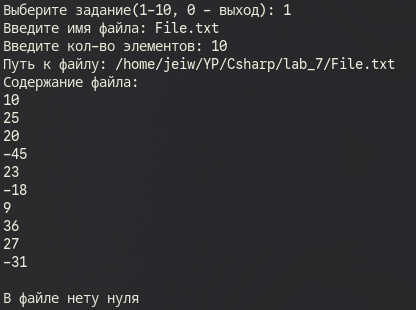
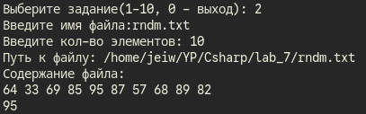
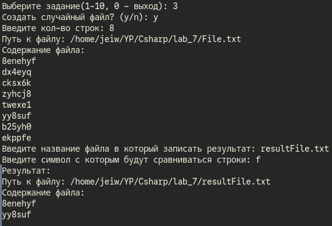
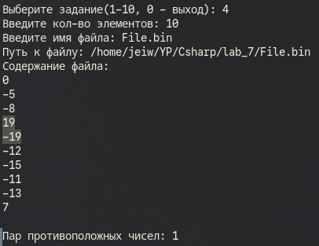
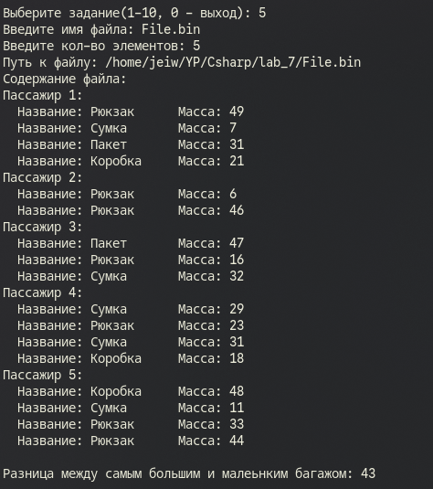
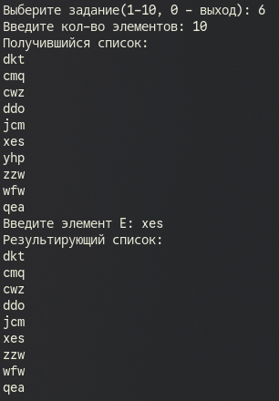
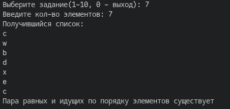
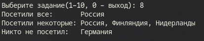
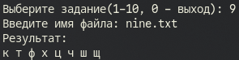
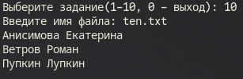

# Сурков Яков КМБ-1 Лабароторная №7

# Задание 1. Текстовые файлы
## Задача 4
### Текст задачи
Для заданного файла возвратить true, если он не содержит нуля, и false в противном случае.

### Описание логики программы
Программа начинается с ввода пользователем названия файла. После чего создается объект с этим файлом, также проверяется корректность имени файла, и его существовние. Если название некорректно, пользватель должен ввести название по новой. Если файл не существует, то создается пустой файл.
Далее генерируется несколько случайных целых чисел, которыми перезаписывается содержание файла.
После содержимое файла считывается и значение каждой строки сравнивается с нулем, если ноль есть в файле возвращается истиное значение, в ином случае ложное значение.
### Тестирование

# Задание 2. Текстовые файлы
## Задача 4
### Текст задачи
Вычислить максимальный элемент.
### Описание логики программы
Программа начинается с ввода пользователем названия файла. После чего создается объект с этим файлом, также проверяется корректность имени файла, и его существовние. Если название некорректно, пользватель должен ввести название по новой. Если файл не существует, то создается пустой файл.
Далее генерируется несколько случайных целых чисел, которыми перезаписывается содержание файла.
После содержимое файла считывается и все значения поэтапно сравниваются с минимальным значением, если текущее значение больше, то минимальное изменяется на текущее значение.
По итогу выводится наибольшее значение из файла.

### Тестирование

# Задание 3. Текстовые файлы
## Задача 4
### Текст задачи
Переписать в другой файл строки, оканчивающиеся на заданный символ.
### Описание логики программы
Программа начинается с вопроса пользователю создавать ли случайный файл:
 - Если да, то создается файл с случайными строковыми значениями
 - Если нет, то пользователь вводит название файла, также проверяется корректность названия и его существование аналогично с прошлыми задачами.

Далее программа запрашивает у пользователя символ с которым будут сравниваться строки файла.
После программа сравнивает окончание строки файла с символом пользователя, если строка заканичвается на этот символ - программа добавляет эту строку в результат.
Далее получившаяся строка записывается в новый файл, который укажет пользователь, и этот файл выводится
### Тестирование

# Задание 4. Бинарные файлы
## Задача 4
### Текст задачи
Подсчитать количество пар противоположных чисел среди компонент исходного файла.
### Описание логики программы
Программа начинается с вопроса пользователю создавать ли случайный файл:
 - Если да, то создается файл с случайными строковыми значениями
 - Если нет, то пользователь вводит название файла, также проверяется корректность названия и его существование аналогично с прошлыми задачами.

Далее программа запрашивает у пользователя символ с которым будут сравниваться строки файла.
После программа сравнивает окончание строки файла с символом пользователя, если строка заканичвается на этот символ - программа добавляет эту строку в результат.
Далее получившаяся строка записывается в новый файл, который укажет пользователь, и этот файл выводится
### Тестирование

# Задание 5. Бинарные файлы и структуры
## Задача 4
### Текст задачи
Информация о багаже пассажира описывается массивом, где каждый элемент содержит название единицы багажа (чемодан, сумка, коробка и т.д.) и ее массу. Дан файл, содержащий сведения о багаже нескольких пассажиров. На сколько багаж максимальной массы отличается от багажа минимальной массы?
### Описание логики программы
Программа начинается с вопроса пользователю создавать ли случайный файл:
 - Если да, то создается файл с случайными строковыми значениями
 - Если нет, то пользователь вводит название файла, также проверяется корректность названия и его существование аналогично с прошлыми задачами.

Далее программа запрашивает у пользователя символ с которым будут сравниваться строки файла.
После программа сравнивает окончание строки файла с символом пользователя, если строка заканичвается на этот символ - программа добавляет эту строку в результат.
Далее получившаяся строка записывается в новый файл, который укажет пользователь, и этот файл выводится
### Тестирование

# Задание 6. List
## Задача 4
### Текст задачи
Составить программу, которая удаляет из списка L за каждым вхождением элемента E один элемент, если такой есть, и он отличен от E.
### Описание логики программы
Программа начинается с вопроса пользователю создавать ли случайный файл:
 - Если да, то создается файл с случайными строковыми значениями
 - Если нет, то пользователь вводит название файла, также проверяется корректность названия и его существование аналогично с прошлыми задачами.

Далее программа запрашивает у пользователя символ с которым будут сравниваться строки файла.
После программа сравнивает окончание строки файла с символом пользователя, если строка заканичвается на этот символ - программа добавляет эту строку в результат.
Далее получившаяся строка записывается в новый файл, который укажет пользователь, и этот файл выводится
### Тестирование

# Задание 7. LinkedList
## Задача 4
### Текст задачи
Определить, есть ли в списке L хотя бы один элемент, который равен следующему за ним (по кругу) элементу (первый элемент считать следующим для последнего).
### Описание логики программы
Программа начинается с вопроса пользователю создавать ли случайный файл:
 - Если да, то создается файл с случайными строковыми значениями
 - Если нет, то пользователь вводит название файла, также проверяется корректность названия и его существование аналогично с прошлыми задачами.

Далее программа запрашивает у пользователя символ с которым будут сравниваться строки файла.
После программа сравнивает окончание строки файла с символом пользователя, если строка заканичвается на этот символ - программа добавляет эту строку в результат.
Далее получившаяся строка записывается в новый файл, который укажет пользователь, и этот файл выводится
### Тестирование

# Задание 8. HashSet
## Задача 4
### Текст задачи
Есть перечень стран, популярных у туристов. Определить для каждой страны, какие из них посетили все n туристов, какие — некоторые из туристов, и какие — никто из туристов.
### Описание логики программы
Программа начинается с вопроса пользователю создавать ли случайный файл:
 - Если да, то создается файл с случайными строковыми значениями
 - Если нет, то пользователь вводит название файла, также проверяется корректность названия и его существование аналогично с прошлыми задачами.

Далее программа запрашивает у пользователя символ с которым будут сравниваться строки файла.
После программа сравнивает окончание строки файла с символом пользователя, если строка заканичвается на этот символ - программа добавляет эту строку в результат.
Далее получившаяся строка записывается в новый файл, который укажет пользователь, и этот файл выводится
### Тестирование

# Задание 9. HashSet
## Задача 4
### Текст задачи
Файл содержит текст на русском языке. Напечатать в алфавитном порядке все глухие согласные буквы, которые не входят ровно в одно слово.
### Описание логики программы
Программа начинается с вопроса пользователю создавать ли случайный файл:
 - Если да, то создается файл с случайными строковыми значениями
 - Если нет, то пользователь вводит название файла, также проверяется корректность названия и его существование аналогично с прошлыми задачами.

Далее программа запрашивает у пользователя символ с которым будут сравниваться строки файла.
После программа сравнивает окончание строки файла с символом пользователя, если строка заканичвается на этот символ - программа добавляет эту строку в результат.
Далее получившаяся строка записывается в новый файл, который укажет пользователь, и этот файл выводится
### Тестирование

# Задание 10. Dictionary/SortedList
## Задача 4
### Текст задачи
В некотором вузе абитуриенты проходят предварительное тестирование, по результатам которого могут быть допущены к сдаче вступительных экзаменов в первом потоке.
Тестирование проводится по двум предметам, по каждому предмету абитуриент может набрать от 0 до 100 баллов. При этом к сдаче экзаменов в первом потоке допускаются абитуриенты, набравшие по результатам тестирования не менее `30` баллов по каждому из двух предметов. На вход программы подаются сведения о результатах предварительного тестирования. Известно, что общее количество участников тестирования не превосходит 500.

В первой строке вводится количество абитуриентов, принимавших участие в тестировании, N. Далее следуют N строк, имеющих следующий формат:

`<Фамилия><Имя><Баллы>`

Здесь `<Фамилия>` – строка, состоящая не более чем из 20 символов;

`<Имя>` – строка, состоящая не более чем из 15 символов;

`<Баллы>` – строка, содержащая два целых числа, разделенных пробелом, соответствующих баллам, полученным на тестировании по каждому из двух предметов. 

При этом `<Фамилия>` и `<Имя>`, `<Имя>` и `<Баллы>` разделены одним пробелом.

Примеры входных строк:

`Ветров Роман 68 59`

`Анисимова Екатерина 64 88`

Напишите программу, которая будет выводить на экран фамилии и имена абитуриентов, потерпевших неудачу, то есть не допущенных к сдаче экзаменов в первом потоке. При этом фамилии должны выводиться в алфавитном порядке.

### Описание логики программы
Программа начинается с вопроса пользователю создавать ли случайный файл:
 - Если да, то создается файл с случайными строковыми значениями
 - Если нет, то пользователь вводит название файла, также проверяется корректность названия и его существование аналогично с прошлыми задачами.

Далее программа запрашивает у пользователя символ с которым будут сравниваться строки файла.
После программа сравнивает окончание строки файла с символом пользователя, если строка заканичвается на этот символ - программа добавляет эту строку в результат.
Далее получившаяся строка записывается в новый файл, который укажет пользователь, и этот файл выводится
### Тестирование

